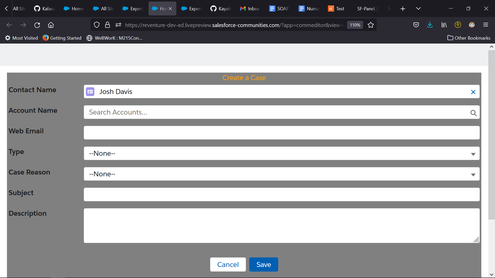

# Project 1: First Experience site LWC

The Project Consists Of my first LWC I created for Experience Site

## Technologies Used

- LWC
- Apex Classes and Methods
- Apex Triggers
- Experience site
- Case standardObject

## Features

Features Ready:
  The Project Fetures the ability to create a case from the experience site and place it in the org. 
  There are apex trigger validation rules that prevent blank entries into the feilds.
  There is a trigger that automaticaly states that the case was created though the web.

To-do List:
  Add Additional cutomization. 
  Create a package for easier use of features.

## Getting Started

git clone https://github.com/Kalavast/Project_RE_1
Authorise the code to an experience site (I sugest using VSC, Visual Studio Code).
in VSC (Ctr-shift-p and then hit authorise source to org).
Login to a saleforce org of your choosing.
Add component to experience site.

## Usage

Enter parameters into the feilds displayed in the component.
Hit save.
Open up the cases list in your org and see its creation.

